# Smart Serve Frontend - Restaurant Management System

## 📋 Overview

Smart Serve Frontend is a modern, responsive web application built with **Angular 19** that provides a comprehensive restaurant management interface. Designed for multi-role usage (Admin, Cashier, Waiter, Cook, Baker), it offers real-time updates, intuitive workflows, and mobile-first design optimized for restaurant operations.

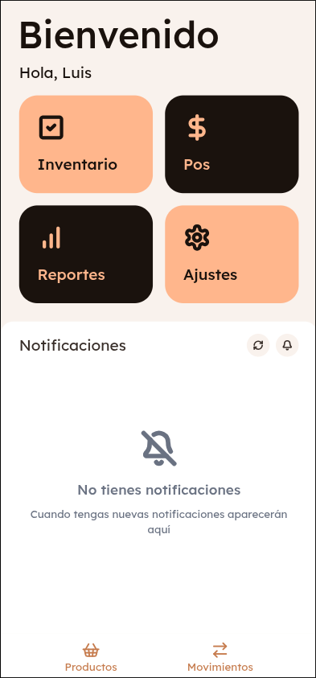

## 🚀 Key Features

### 🎯 **Multi-Role Interface**

- **Responsive design** optimized for tablets and mobile devices
- **Role-based UI** with dynamic component rendering
- **Intuitive navigation** designed for fast-paced restaurant environment
- **Real-time notifications** for kitchen operations and inventory alerts

### 📱 **Mobile-First Design**

- **Capacitor integration** for native mobile app capabilities
- **Custom navigation system** optimized for mobile UX
- **Touch-friendly interface** with large buttons and gestures
- **Offline capabilities** with local state management

### 🔄 **Real-Time Features**

- **WebSocket integration** for live kitchen updates
- **Dashboard live metrics** with automatic refresh
- **Order status tracking** across all user roles
- **Inventory alerts** and stock level monitoring

### 💰 **Complete POS System**

- **Order context management** with persistent state
- **Multi-step order creation** with navigation preservation
- **Table management** with visual status indicators
- **Payment processing** with multiple payment methods<

## 🛠️ Technology Stack

### **Core Framework**

- **Angular 19** - Latest Angular with standalone components
- **TypeScript 5.x** - Type-safe development
- **RxJS** - Reactive programming for state management
- **Capacitor** - Cross-platform mobile app development

### **UI & Styling**

- **Tailwind CSS 4** - Utility-first CSS framework
- **Custom Component Library** - Reusable UI components
- **Responsive Design** - Mobile-first approach
- **Theme System** - Consistent design language

### **Data Visualization**

- **ApexCharts** - Interactive charts and graphs
- **Real-time Dashboard** - Live metrics and KPIs
- **Sales Analytics** - Revenue and performance visualization
- **Inventory Charts** - Stock levels and trends

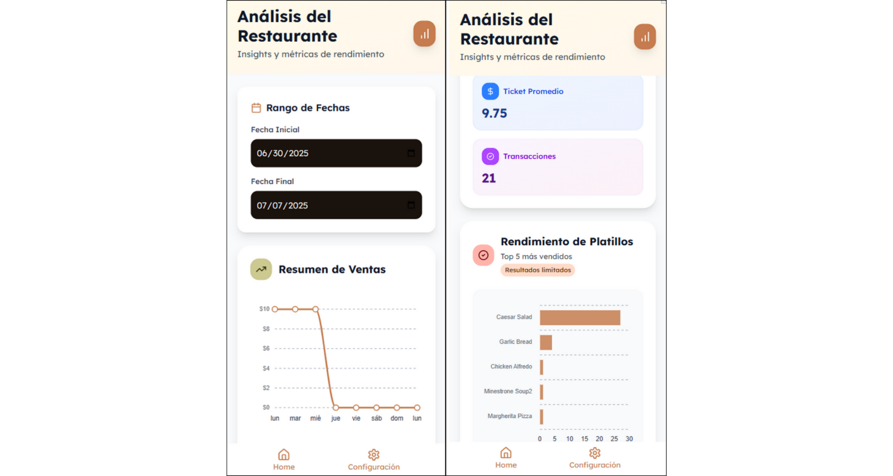

### **Real-Time Communication**

- **rx-stomp** - WebSocket client for STOMP protocol
- **Real-time Updates** - Kitchen operations and dashboard
- **Event-Driven Architecture** - Reactive state updates
- **Connection Management** - Automatic reconnection handling

## 🏗️ Architecture

### **Project Structure**

```
src/app/
├── core/                    # Application core logic
│   ├── constants/          # Global constants and configuration
│   ├── enums/              # TypeScript enumerations
│   ├── guards/             # Route protection (AuthGuard, RoleGuard)
│   ├── interceptors/       # HTTP interceptors (Auth, Error handling)
│   ├── models/             # TypeScript interfaces and DTOs
│   └── services/           # Business logic and API services
├── layout/                 # Global layout components
├── lib/                    # Utility libraries and helpers
├── pages/                  # Feature modules and page components
│   ├── home/              # Main dashboard and navigation
│   ├── pos/               # Point of Sale module
│   ├── inventory/         # Inventory management
│   ├── reports/           # Analytics and reporting
│   └── settings/          # Administrative settings
├── routes/                # Navigation and routing configuration
├── shared/                # Reusable components and utilities
└── styles/                # Global styles and theming
```

### **Custom Navigation System**

The application implements a hierarchical navigation system optimized for mobile and restaurant workflows:

```typescript
// Custom navigation with context preservation
export interface NavItem {
  key: string;
  name: string;
  icon: string;
  path: string;
  children?: NavItem[];
  fullPath?: string;
  parentKey?: string;
}

// Centralized navigation structure
const NAV_ITEMS: NavigationItem[] = [{ key: "components", name: "Componentes", icon: "layout-grid", path: "/components" }];
```

## 🔐 Security & Authentication

### **JWT Token Management**

- **Automatic token refresh** with seamless user experience
- **Secure storage** using localStorage with encryption
- **HTTP interceptors** for automatic header injection
- **Session persistence** across page refreshes

```typescript
@Injectable()
export class AuthInterceptor implements HttpInterceptor {
  AuthInterceptor: HttpInterceptorFn = (request: HttpRequest<unknown>, next: HttpHandlerFn): Observable<HttpEvent<unknown>> => {
    // Auto-inject JWT tokens
    // Handle 401 responses with token refresh
    // Maintain authentication state
  };
}
```

### **Role-Based Access Control**

Custom directive for component-level permission management:

```typescript
@Directive({ selector: "[appHasRole]" })
export class HasRoleDirective {
  @Input() appHasRole: string | string[];

  // Dynamically enable/disable components based on user role
  // Real-time permission updates
  // Visual feedback for restricted actions
}
```

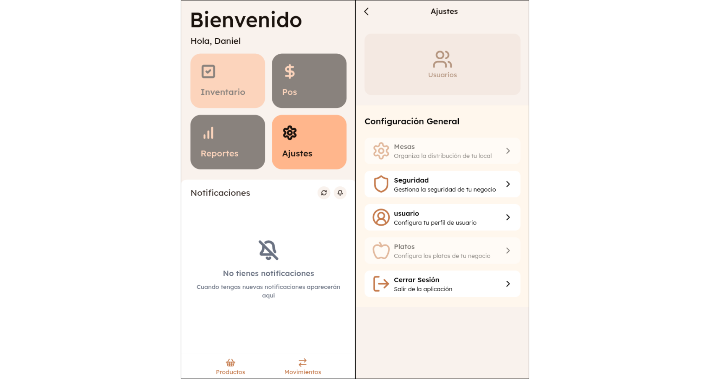

## 📱 Core Modules

### 💳 **Point of Sale (POS)**

Complete sales management system:

#### **Kitchen Module**

- **Real-time order display** with WebSocket updates
- **Order status management** (Pending → In Preparation → Ready → Served)
- **Cook assignment** and preparation tracking
- **Visual order queue** with time indicators

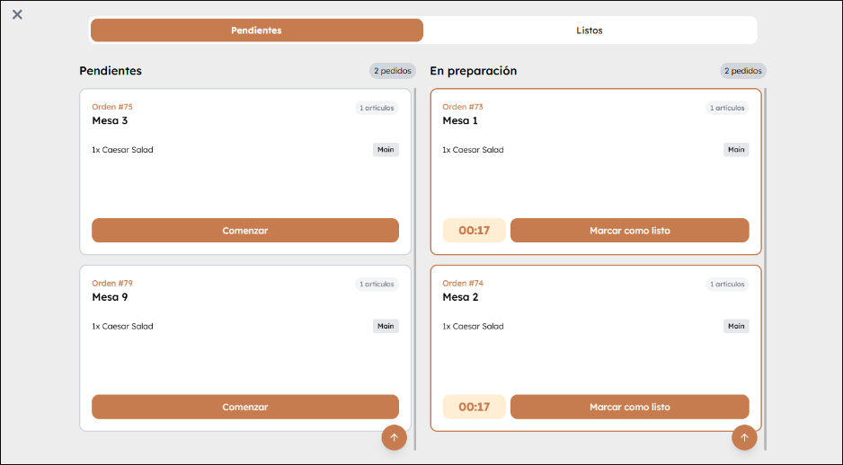

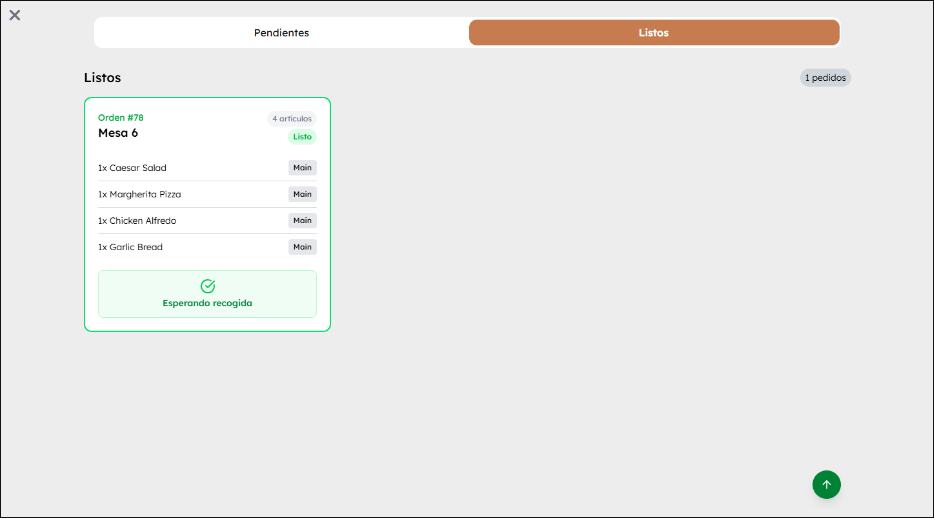

#### **Cash Register**

- **Session management** (Open/Close register)
- **Transaction recording** with audit trail
- **Movement tracking** (Income, Expense, Adjustments)
- **End-of-day reporting** with reconciliation

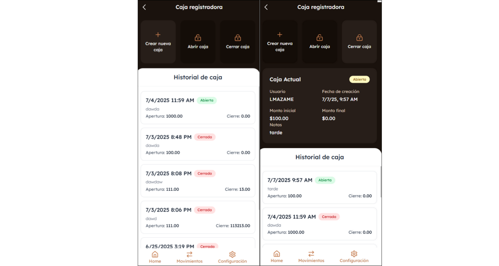

#### **Sales Interface**

Advanced order creation with context management:

- **Persistent order state** survives page navigation
- **Table selection** with visual status indicators
- **Menu browsing** with categories and search
- **Order customization** with modifications and notes
- **Multi-step workflow** with data preservation

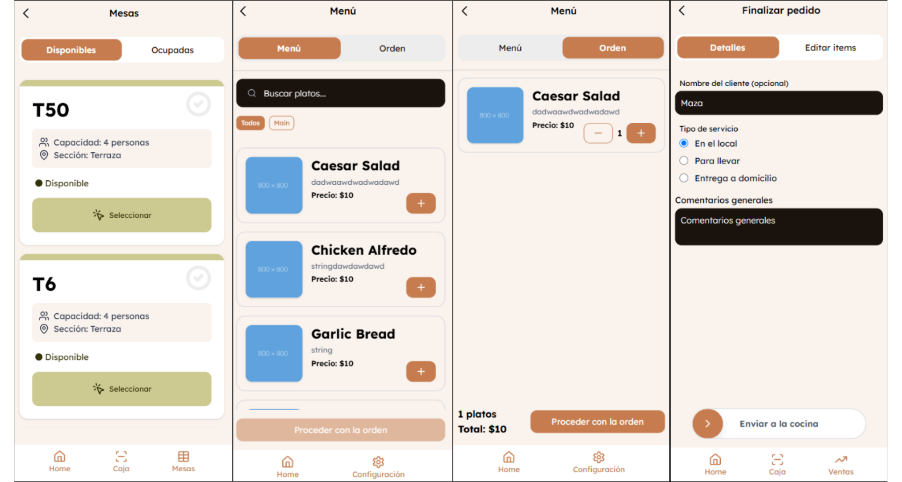

### 📦 **Inventory Management**

Real-time inventory control system:

#### **Dashboard**

- **Live metrics** with WebSocket updates
- **Stock level indicators** with color-coded alerts
- **Recent movements** activity feed
- **Category-wise analysis** with charts

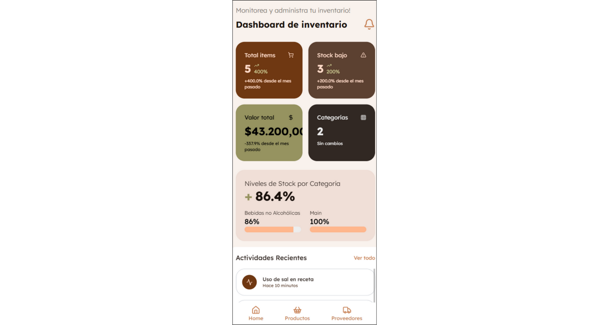

#### **Product Management**

- **CRUD operations** for inventory items
- **Batch operations** for bulk updates
- **Movement tracking** with detailed audit trail
- **Manual adjustments** with reason codes

#### **Movement History**

- **Filtered search** by date, type, and user
- **Detailed logs** with before/after quantities
- **Export capabilities** for reporting
- **Reference tracking** to orders and purchases

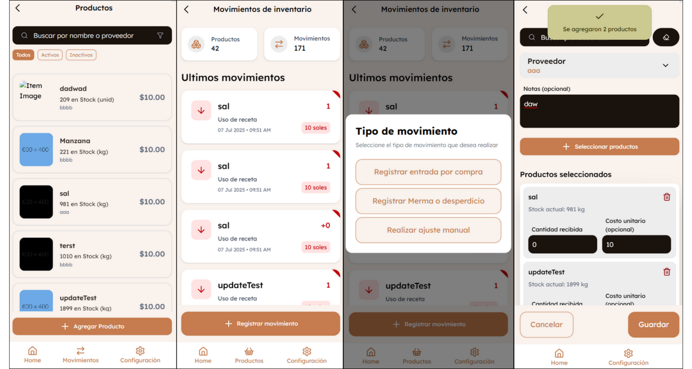

### 📊 **Reports & Analytics**

Comprehensive business intelligence:

#### **Sales Reports**

- **Revenue analysis** with time-based grouping
- **Waiter performance** metrics and rankings
- **Product sales** analysis with profitability
- **Payment method** distribution charts

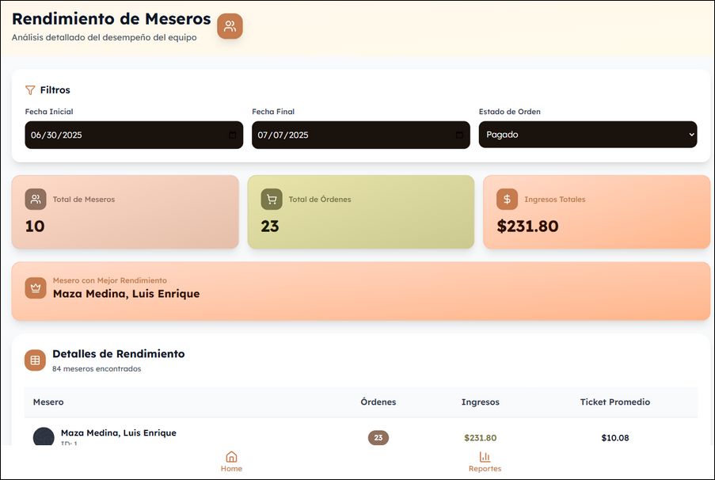

### ⚙️ **Settings & Administration**

Administrative tools for system management:

#### **User Management**

- **CRUD operations** for staff accounts
- **Role assignment** and permission management
- **Profile management** with image uploads
- **Activity tracking** and audit logs

#### **Menu Management**

- **Dish creation** with recipe integration
- **Category organization** for menu structure
- **Price management** and updates
- **Image management** for menu items

#### **System Configuration**

- **Table management** with capacity and sections
- **Supplier information** and contact details
- **System parameters** and business rules
- **User profile** settings and preferences

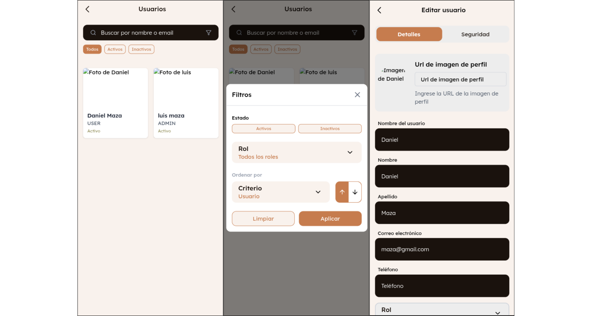

## 🔄 State Management

### **Order Context Service**

Sophisticated state management for order creation:

```typescript
@Injectable()
export class OrderStateService {
  private orderContext = new BehaviorSubject<OrderContext>(null);

  // Persistent state across navigation
  // Local storage backup for reliability
  // Context preservation during page refreshes
  // Multi-step workflow support
}
```

### **Real-Time Updates**

WebSocket integration for live data:

```typescript
@Injectable()
export class WebSocketService {
  private stompClient: RxStomp;

  // Kitchen order updates: /topic/kitchen/order-updates
  // Inventory dashboard: /topic/dashboard/inventory
  // Automatic reconnection handling
  // Message queuing for offline scenarios
}
```

## 🎨 User Experience

### **Mobile-First Design**

- **Touch-optimized interface** with appropriate button sizes
- **Gesture support** for common actions
- **Responsive layouts** that adapt to screen sizes
- **Fast loading** with optimized assets

### **Performance Optimizations**

- **Lazy loading** for feature modules
- **OnPush change detection** for better performance
- **Optimized bundle size** with tree shaking
- **Caching strategies** for API responses

## 🔧 Development Features

### **Code Quality**

- **TypeScript strict mode** for type safety
- **Modular architecture** with feature separation
- **Reusable components** and services
- **Consistent coding standards** across the project

### **Developer Experience**

- **Hot reloading** for fast development
- **Environment configuration** for different stages
- **Error handling** with proper logging
- **Documentation** in code comments

## 🚀 Installation & Setup

### **Prerequisites**

- **Node.js 18+** and npm
- **Angular CLI 19** globally installed
- **Smart Serve Backend** running
- **AuthService** microservice available

### **Environment Configuration**

```typescript
// src/environments/environment.ts
export const environment = {
  production: false,
  apiUrl: "http://localhost:8080/api/v1",
  authServiceUrl: "http://localhost:8081/api/v1",
  wsUrl: "ws://localhost:8080/ws",
};
```

### **Installation Steps**

```bash
# Clone the repository
git clone https://github.com/your-username/smart-serve-frontend.git
cd smart-serve-frontend

# Install dependencies
pnpm install

# Start development server
png serve

# Build for production
png build

# Build for mobile
npx cap build
```

### **Mobile Development**

```bash
# Add mobile platforms
npx cap add ios
npx cap add android

# Sync with native platforms
npx cap sync

# Open in native IDEs
npx cap open ios
npx cap open android
```

## 📱 Mobile Capabilities

### **Capacitor Integration**

- **Native navigation** with custom routing system

## 🔗 API Integration

### **HTTP Client Configuration**

- **Interceptors** for authentication and error handling
- **Request/Response** transformation
- **Loading states** management
- **Error boundary** implementation

### **WebSocket Management**

- **Connection lifecycle** management
- **Message queuing** for reliability
- **Reconnection strategies** for network issues
- **Real-time data synchronization**

## 🎯 Performance Metrics

### **Bundle Analysis**

- **Optimized bundle size** with lazy loading
- **Tree shaking** for unused code elimination
- **Code splitting** by feature modules
- **Asset optimization** for faster loading

### **Runtime Performance**

- **Memory management** with proper subscription handling
- **Virtual scrolling** for large data sets

## 🌐 Browser Support

- **Chrome/Chromium** 90+ (Primary target)
- **Firefox** 85+ (Full support)
- **Safari** 14+ (iOS compatibility)
- **Edge** 90+ (Windows tablet support)

## 📖 Usage Examples

### **Creating an Order (Waiter Flow)**

1. **Select table** from available options
2. **Browse menu** with category filtering
3. **Add items** with customizations
4. **Review order** with customer details
5. **Send to kitchen** for preparation

### **Kitchen Operations (Cook Flow)**

1. **View incoming orders** in real-time
2. **Claim order** for preparation
3. **Track preparation** progress
4. **Mark as ready** when completed

### **Cash Register (Cashier Flow)**

1. **Open register** with initial amount
2. **Process transactions** throughout the day
3. **Record movements** (income/expenses)
4. **Close register** with final reconciliation

## 🔮 Future Enhancements

### **Planned Features**

- **Unit testing** implementation with Jest/Jasmine
- **E2E testing** with Cypress or Playwright
- **Advanced PWA features** (background sync, push notifications)
- **Multi-language support** (i18n implementation)
- **Dark theme** and accessibility improvements

### **Technical Improvements**

- **State management** with NgRx for complex scenarios
- **Component library** extraction for reusability
- **Micro-frontend** architecture for scalability
- **Performance monitoring** with analytics integration

## 🔗 Related Projects

- **[Smart Serve Backend](https://github.com/Maza92/smart-serve-backend)** - Spring Boot API and business logic
- **[AuthService](https://github.com/Maza92/AuthService.git)** - Authentication microservice
